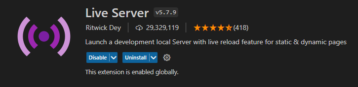
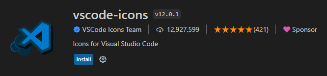
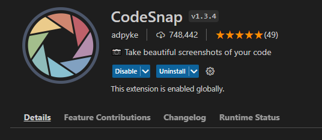

# extensions-vscode
My useful extensions list for VSCode
 
AUTO CLOSE TAG by Jun Han
 

 
AUTO RENAME TAG by Jun Han
 

 
LIVE SERVER by Ritwick Dey (Recommend)
 

 
LIVE PREVIEW by Microsoft (live immediately but sometimes not working so far)
 

 
INDENT RAINBOW by Oderwat
 

 
VSCODE-ICON by VScode icons team
 

 
CODESNAP by adpyke
 

